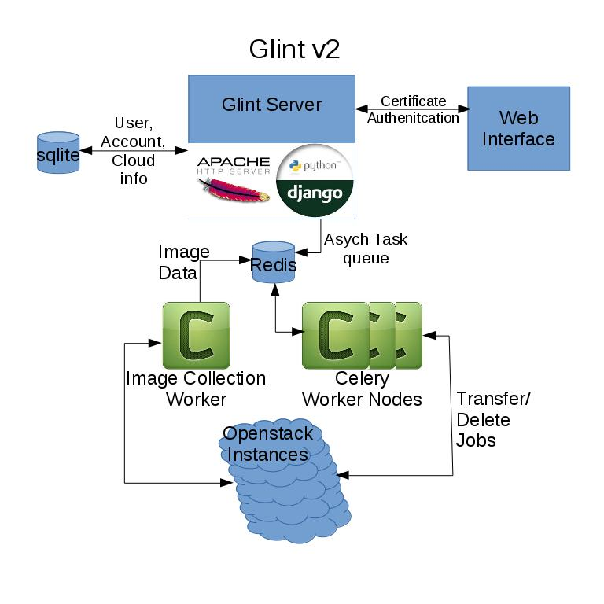

# Glint v2

## Overview
Glint Version 2 aims to replicate the functionality of the original Glint
while simplifying it by decoupling it from an Openstack instance.

The basic premise is to use grid certificates to authenticate users and 
allow them to transfer virtual machine images between openstack project
repositories. Glint v2 accomplishes this by running a Django webserver
using apache+mod_ssl to authenticate user certificates and provide a
web interface to expose the glint services.

Authenticated users are able to use the interface to add openstack instances
to glint which in turn populates a matrix of virtual machine images (VMs) and
openstack projects. Users are then able to use the check boxes in the matrix
to queue transfers or deletions of VMs.

## Deployment

The deployment of Glint v2 has been largely streamlined, however, there is still
some manual configuration required. These steps include: Generating a secret key
for the django server, installing the required certificates, making database
migrations, configuring an admin user for glint that can add other new users.

To simplify, follow these steps to install glint.

1. Download the [ansible playbook](https://github.com/hep-gc/ansible-systems/tree/glintv2/heprc/glintv2) and configure your target host.
2. Run the ansible playbook `ansible-playbook glintv2.yaml`.
3. Next log into the server as root and install your certificates.
The CABundle.crt goes into `/etc/glintv2/` while the other certificate files go to
`/etc/pki/tls/certs/`
4. Start the redis server `service redis start`.
5. Go to the glintv2 folder `cd /opt/Glintv2/` and run the django database  
migration to set up the database:  
`python manage.py migrate`  
6. Generate a secret key for the glint django server using the `/opt/Glintv2/config/key_gen.py`  
and play it in the `/opt/Glinvtv2/glintv2/settings.py` file.
7. Start the celery and httpd services:  
`service celery start`  
`service httpd start`  
8. Now the web service should be running. Try to connect to the ip of the server in
your browser. This will cause the apache server to register your certificate with glint.
9. Once your certificate has been entered into the database we need to elevate your
permissions such that you can access glint and add other users. After you have attempted
to connect with your browser run the configure_admin script in `/opt/Glintv2/`. You will
be asked to provide your Distinguished namd and your Common name from your certificate.
10. Try to connect in your browser again and you should have full permissions over glint!